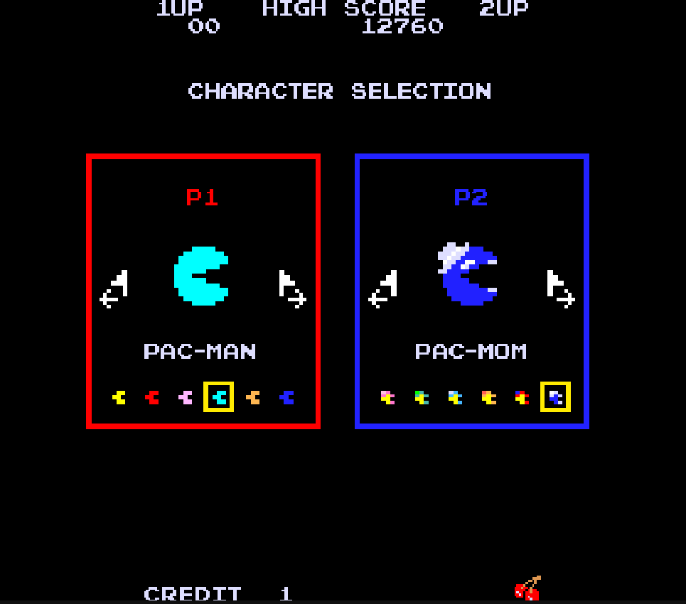

# Pac-Man

This project is a **fan-made remake** of the classic arcade game **Pac-Man**, originally developed by **Namco** (now Bandai Namco Entertainment). It was created for **educational and non-commercial purposes** to explore classic game mechanics, ghost AI/phasing, and level flow in Unity.

> **Disclaimer:** This repository is not affiliated with or endorsed by Bandai Namco Entertainment.

## Features

- **Classic loop:** pellets, power pellets, fruit, lives, score, and the iconic ghost pressure curve.
- **Ghost phase controller:** global **Scatter/Chase** schedule, properly frozen during READY!, pause, and cutscenes.
- **Local multiplayer (hot-seat):**
  - Flexible per-turn device pairing: share one keyboard, mix keyboard + gamepad, or use multiple gamepads.
  - Character & skin selection per player, with duplicate-skin prevention.
- **Character Select scene:**
  - Per-panel input **claiming** (first valid press), then **binding masks** so panels don’t interfere.
  - Deterministic keyboard schemes (Panel 1 → `P1Keyboard`, Panel 2 → `P2Keyboard`, etc.).
- **Polished UI:**
  - Player labels, **flicker** highlight for the current player, and clean turn swaps.
- **Modular code:** clear separation of game flow (`GameManager`), UI (`UIManager`), selection (`CharacterSelectionManager` / `CharacterSelectorPanel`), and character logic (`Pacman`).

   

## Controls

Each control is mapped to a Unity action so it plugs directly into the Input System.

- **Move** → `Move` (Vector2 2D Composite)
- **A (Confirm)** → `Submit`
- **B (Back)** → `Cancel`
- **Start** → `Pause`
- **Select** → `Special` *(separate action so it never accidentally confirms or cancels)*

### Player 1 — `P1Keyboard`

- **Move:** `W A S D`  
- **Start (Pause):** `Tab`  
- **Select (Special):** `Left Shift`  
- **A (Confirm):** `Space`  
- **B (Back):** `Q`

### Player 2 — `P2Keyboard`

- **Move:** Arrow Keys `↑ ← ↓ →`  
- **Start (Pause):** `Right Shift`  
- **Select (Special):** `Right Alt`  
- **A (Confirm):** `/` (Slash)  
- **B (Back):** `.` (Period)

### Gamepad — `Gamepad` scheme (for any player)

- **Move:** D-Pad (also Left Stick)  
- **Start (Pause):** Start / Options  
- **Select (Special):** View / Select / Share  
- **A (Confirm):** South (A / ✕)  
- **B (Back):** East (B / ○)

## Credits

- [Zigurous](https://www.youtube.com/watch?v=TKt_VlMn_aA&t=10891s) — project head start  
- [The Pac-Man Dossier](https://pacman.holenet.info/) — in-depth reference on Pac-Man mechanics  
- [The Spriters Resource](https://www.spriters-resource.com/profile/caylie+c/) — sprites 
